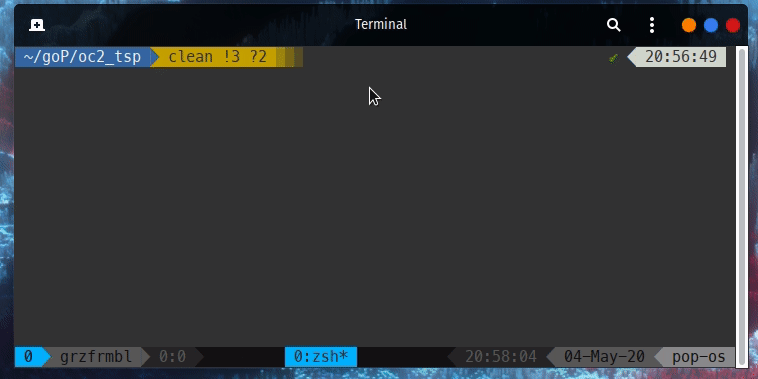

# Traveling Salesman Problem 
## Exhaustive search
This solution uses exhaustive search (simply try all all possible paths) to find a solution for given distance matrix and starting point.

## Build

Building from source requires a Go installation, see https://golang.org/doc/install for details.

`go build` in the root folder will compile the project on your platform. There is also a `deploy.sh` script included which will built for 
a couple of common platforms at once. Some are included in the binaries/ folder.

## Usage

A couple of options are available via cmd flags:
```bash
Usage of ./oc2_tsp:
  -data string
        Path to predefined distance matrix.
  -n int
        Number of cities used.
  -seed
        Custom rand. number generation seed.
```
 
##### Example




Runs a TSP problem exhaustive search, 10 cities. Path lengths are set at random [1...1000].

## Test instances

Test data is taken from [here](https://people.sc.fsu.edu/~jburkardt/datasets/tsp/tsp.html) and can be found in the data/ folder.
If you want to include data yourself simply convert it to a JSON array of integers. 
